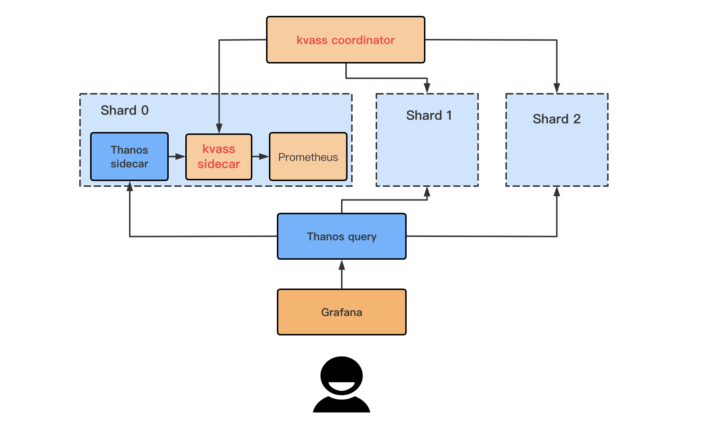

<div align=center></div>

[中文版](./README_CN.md)

Kvass is a [Prometheus](https://github.com/prometheus/prometheus) horizontal auto-scaling solution ,  which uses Sidecar to generate special config file only containes part of targets assigned from Coordinator for every Prometheuses shard.

Coordinator do service discovery, shards management and assigned targets to each of them.
[Thanos](https://github.com/thanos-io/thanos) (or other storage solution) is used for global data view.

  [](https://goreportcard.com/report/github.com/tkestack/kvass)  []()   [](https://codecov.io/gh/tkestack/kvass)

------

# Table of Contents
   * [Overview](#overview)
   * [Architecture](#architecture)
      * [Components](#components)
         * [Coordinator](#coordinator)
         * [Sidecar](#sidecar)
      * [Kvass + Thanos](#kvass--thanos)
      * [Kvass + Remote storage](#kvass--remote-storage)
      * [Multiple replicas](#multiple-replicas)
   * [Demo](#Demo)
   * [Flag values suggestion](#Flag-values-suggestion)
   * [License](#license)


# Overview

Kvass is a Prometheus horizontal auto-scaling solution with following features. 

* Easy to use
* Tens of millions series supported (thousands of k8s nodes)
* One prometheus configuration file
* Auto scaling
* Sharding according to the actual target load instead of label hash
* Multiple replicas supported

# Architecture


## Components

### Coordinator

See flags of Coordinator [code](https://github.com/tkestack/kvass/blob/master/cmd/kvass/coordinator.go#L61)

* Coordinaotr loads origin config file and do all prometheus service discovery
* For every active target, Coordinator do all "relabel_configs" and explore target series scale
* Coordinaotr periodly try assgin explored targets to Sidecar according to Head Block Series of Prometheus.


### Sidecar

See flags of Sidecar [code](https://github.com/tkestack/kvass/blob/master/cmd/kvass/sidecar.go#L48)

* Sidecar receive targets from Coordinator.Labels result of target after relabel process will also be send to Sidecar.

* Sidecar generate a new Prometheus config file only use "static_configs" service discovery, and delete all "relabel_configs".

* All Prometheus scraping request will be proxied to Sidecar for target series statistics.

  

  

## Kvass + Thanos

Since the data of Prometheus now distribut on shards, we need a way to get global data view.

[Thanos](https://github.com/thanos-io/thanos) is a good choice. What we need to do is adding Kvass sidecar beside Thanos sidecar, and setting up a Kvass coordinator.



## Kvass + Remote storage

If you want to use remote storage like influxdb, just set "remote write" in origin Prometheus config.

## Multiple replicas

Coordinator use label selector to select shards StatefulSets, every StatefulSet is a replica, Kvass puts together Pods with same index of different StatefulSet into one Shards Group.

> --shard.selector=app.kubernetes.io/name=prometheus

# Demo

There is a example to show how Kvass work.

> git clone https://github.com/tkestack/kvass
>
> cd kvass/example
>
> kubectl create -f ./examples

you can found a Deployment named "metrics" with 6 Pod, each Pod will generate 10045 series (45 series from golang default metrics) metircs。

we will scrape metrics from them。


the max series each Prometheus Shard can scrape is a flag of Coordinator Pod.

in the example case we set to 30000.

> ```
> --shard.max-series=30000
> ```

now we have 6 target with 60000+ series  and each Shard can scrape 30000 series，so need 3 Shard to cover all targets.

Coordinator  automaticly change replicate of Prometheus Statefulset to 3 and assign targets to them.


only 20000+ series in prometheus_tsdb_head of one Shard


but we can get global data view use thanos-query


#  Flag values suggestion

The memory useage of every Prometheus is associated with the max head series.

The recommended "max series" is 750000, set  Coordinator flag

> --shard.max-series=750000

The memory request of Prometheu with 750000 max series is 8G.

# License

Apache License 2.0, see [LICENSE](./LICENSE).

